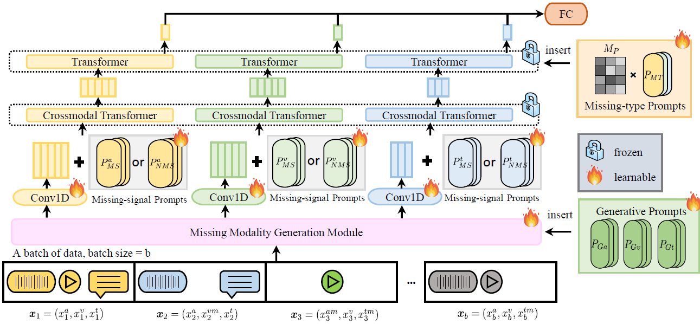

# Multimodal Prompt Learning with Missing Modalities for Sentiment Analysis and Emotion Recognition

[ACL 2024 Main] Official PyTorch implementation of the paper "Multimodal Prompt Learning with Missing Modalities for Sentiment Analysis and Emotion Recognition"

## Introduction

The development of multimodal models has significantly advanced multimodal sentiment analysis and emotion recognition. However, in real-world applications, the presence of various missing modality cases often leads to a degradation in the model's performance. In this work, we propose a novel multimodal Transformer framework using prompt learning to address the issue of missing modalities. Our method introduces three types of prompts: generative prompts, missing-signal prompts, and missing-type prompts. These prompts enable the generation of missing modality features and facilitate the learning of intra- and inter-modality information. Through prompt tuning, we achieve a substantial reduction in the number of trainable parameters. Extensive experiments and ablation studies are conducted to demonstrate the effectiveness and robustness of our method, showcasing its ability to effectively handle missing modalities. 




## Getting Started

### Requirements

- Python >= 3.8, PyTorch >= 1.8.0


```
git clone https://github.com/zrguo/MPLMM.git
```

### Datasets

The extracted features are provided under the corresponding repositories of the papers cited in the raw feature extraction part of our paper, and can be downloaded directly. 

Additionally, MPLMM can be extended to other datasets and backbones, not limited to the MSA task. Therefore, you can also use your own datasets or any feature extraction methods, as long as you make sure that the dataset class has the corresponding  `get_dim`, `get_seq_len` and `get_missing_mode` functions. For feature extraction tool, you can refer to [Tool](https://github.com/thuiar/MMSA-FET) for more information.

### Run the Code

1. Pre-train the model on CMU-MOSEI without prompts
```
mkdir pretrained
python main.py --dataset "mosei" --data_path "mosei path" --drop_rate 0 --name "./pretrained/mosei.pt"
```

2. Fine-tuning the pre-trained model on downstream datasets and get results

- Fine-tuning on CMU-MOSI

  ```
  python main.py --pretrained_model "./pretrained/mosei.pt" --dataset "mosi" --data_path "mosi path" --drop_rate 0.7 --name "mosi.pt"
  ```

- Fine-tuning on IEMOCAP

  ```
  python main.py --pretrained_model "./pretrained/mosei.pt" --dataset "iemocap" --data_path "iemocap path" --drop_rate 0.7 --name "iemocap.pt"
  ```

- Fine-tuning on CH-SIMS

  ```
  python main.py --pretrained_model "./pretrained/mosei.pt" --dataset "sims" --data_path "sims path" --drop_rate 0.7 --name "sims.pt"
  ```

*This is a reconstructed code base. If you find any errors, please pose an issue or contact the authors.*


## Citation

If you find this repository useful, please cite the following paper:
```bibtex
@inproceedings{guo2024multimodal,
  title={Multimodal Prompt Learning with Missing Modalities for Sentiment Analysis and Emotion Recognition},
  author={Guo, Zirun and Jin, Tao and Zhao, Zhou},
  booktitle={Proceedings of the 62nd Annual Meeting of the Association for Computational Linguistics (Volume 1: Long Papers)},
  pages={1726--1736},
  year={2024}
}
```


## Acknowledgements

This code is based on the backbone [MulT](https://github.com/yaohungt/Multimodal-Transformer).